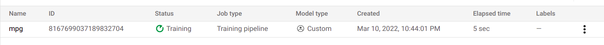

# dps-intern-task
Google's VertexAI demo

Commands are provided in `commands.txt`. Scripts (train.py, Dockerfile, deploy.py, predict.py) are directly available here in this repo.

## Step-1: Create Project

## Step-2: Write the training script and build a docker around it

Look at mpg/trainer/train.py for reference.

__Build the Docker__

__Push the Docker to container registry__

## Step-3: Allocate a VM and start the training

## Step-4: Create and deploy a model endpoint

## Step-5: Predict

